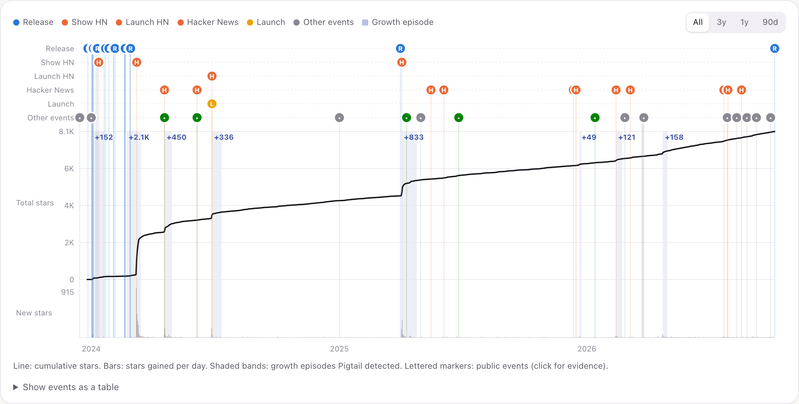

<h1 align="center">pigtail<span>.</span></h1>

<p align="center"><b>See how a product actually grew — from public evidence, with every fact linked to its source.</b></p>

<p align="center">
  <a href="https://suchipizza.github.io/pigtail/">Website</a> ·
  <a href="https://suchipizza.github.io/pigtail/examples/">Example reports</a> ·
  <a href="docs/quickstart.md">5-minute quick start</a> ·
  <a href="docs/methodology.md">How it works</a> ·
  <a href="docs/">Docs</a> ·
  <a href="https://suchipizza.github.io/pigtail/legal/">Legal &amp; privacy</a>
</p>

Pigtail is a command-line tool. You give it a **GitHub repository** or a **product website**. It
reads public evidence — the repository's history, launch posts, Hacker News threads, the founders'
blog posts, interviews and articles — and writes a **growth report**: how the product started, how
it found its first users, what it launched and when, which numbers moved, which tactics it used,
and what is still unknown.

**Reddit API search is optional.** By default, Reddit posts appear only when web search finds them.
If Reddit has approved your own API access, Pigtail can also search Reddit through its official API.
See [Reddit (optional)](#reddit-optional).

For open-source projects, the report shows the **GitHub star history with launches, posts and
releases on the same timeline**, so you can see what was happening around every jump in stars:



Click any marker or any small citation number to see the evidence behind it: the claim, the quote,
the source link and when Pigtail read it.

A 20-second walkthrough (run → report → star timeline → evidence): [docs/assets/demo.gif](docs/assets/demo.gif)

**Who it is for:** open-source maintainers planning a launch, founders and growth people studying
how comparable products grew, and anyone who wants a sourced history instead of a generic summary.

## Install

Python 3.12 or newer. Using [uv](https://docs.astral.sh/uv/):

```bash
uv tool install git+https://github.com/suchipizza/pigtail
```

(or `pipx install git+https://github.com/suchipizza/pigtail`, or `pip install` it inside a virtual
environment.)

## Run

```bash
export ANTHROPIC_API_KEY="sk-ant-..."   # required: Pigtail uses Claude to read sources and search the web
export GITHUB_TOKEN="ghp_..."           # optional: raises GitHub's limit from 60 to 5,000 requests/hour
export REDDIT_CLIENT_ID="..."           # optional, needs Reddit's approval (see "Reddit" below)
export REDDIT_CLIENT_SECRET="..."
export PRODUCTHUNT_TOKEN="..."          # optional: exact Product Hunt launch dates (see "Product Hunt" below)

pigtail doctor                                    # checks your setup, costs nothing
pigtail https://github.com/plausible/analytics    # an open-source project
pigtail tally.so                                  # a product website
```

A run takes a few minutes. With the larger Claude Opus 5.5 model it cost **$1–3** for a repository and **$2–5** for a product website, measured on 10 targets ([validation report](validation/2026-10-06/REPORT.md)). The default model, Claude Sonnet 5.5, costs half as much per token, so expect roughly half that; this has not been measured yet. When it
finishes, the report opens in your browser.

### Choosing a Claude model

Pigtail uses **Claude Sonnet 5.5** unless you choose another model with `--model`:

```bash
pigtail tally.so --model opus              # a short name…
pigtail tally.so --model claude-opus-5-5   # …or a full Claude model ID
pigtail models                             # list the choices
pigtail doctor --model opus                # check the model works with your key (free)
```

| `--model` | Model | $ per 1M tokens (in / out) | Notes |
|---|---|---|---|
| `sonnet` (default) | Claude Sonnet 5.5 (`claude-sonnet-5-5`) | $2 / $10 | Used when you don't pass `--model`. Balanced cost and quality. |
| `opus` | Claude Opus 5.5 (`claude-opus-5-5`) | $4 / $20 | About twice the cost. Measured $1–3 per repository, $2–5 per product website. |
| `haiku` | Claude Haiku 4.5 (`claude-haiku-4-5`) | $1 / $5 | Cheapest. Not tested with Pigtail yet; reports may be thinner. |
| `fable` | Claude Fable 5.1 (`claude-fable-5-1`) | $10 / $50 | Most capable, about 5x the default cost. Not tested with Pigtail yet. |

Any other Claude model ID (`claude-…`) is accepted too. You can also set the model in
`pigtail.toml` (`[model] model = "opus"`, see [troubleshooting](docs/troubleshooting.md#configuration-file)).
Pigtail itself is free; you pay Anthropic for the tokens a run uses, and `run.json` records the cost.
Pigtail never switches models silently: the run starts by printing the model it uses.

### Reddit (optional)

Reddit is where many projects are first shared. By default, Pigtail finds Reddit posts only through
web search: a Reddit post appears in the report when web search finds a link to it, with its title and
date. This is rare, because the search Pigtail uses returns few Reddit pages, so the report notes that
Reddit coverage is incomplete.

**If you already have Reddit API access**, Pigtail can also search Reddit through its official API with
your own app keys. It finds posts that link to or mention the repository (or the product's domain),
plus the same people's other posts that name the project, and puts them on the timeline next to the
star history. It keeps only each post's title, link, subreddit, date, upvotes and comment count, never
the post text or usernames (usernames are used only during the search).

**New Reddit API access needs Reddit's approval.** Reddit's
[Responsible Builder Policy](https://support.reddithelp.com/hc/en-us/articles/42728983564564-Responsible-Builder-Policy)
says you "must request access and get explicit approval before accessing any Reddit data through our
API". Creating an app at <https://www.reddit.com/prefs/apps> is therefore not enough on its own, and
approval for personal projects is not guaranteed. Pigtail works fully without it. If you have
approved keys:

```bash
export REDDIT_CLIENT_ID="..."      # the short string under your app's name
export REDDIT_CLIENT_SECRET="..."
pigtail doctor                     # the "Reddit API" line should say OK
```

> **Your responsibility.** Optional data sources use your own keys, and their terms apply to you
> (Reddit's [Data API Terms](https://redditinc.com/policies/data-api-terms) restrict commercial use).
> The data stays on your computer; Pigtail's maintainers never receive it.

`pigtail <target> --no-reddit` skips the Reddit API for one run. Reports on the Pigtail website never
include Reddit API data, only links found by web search.

### Product Hunt (optional)

By default, Product Hunt launches appear when a source such as the maker's blog mentions them, or as
links found by web search. With **your own free Product Hunt developer token**, Pigtail also asks
Product Hunt's official API for the product's launches and adds each one to the timeline with its exact
date, upvotes and comment count.

The API cannot search by name, so Pigtail looks for Product Hunt links on the product's homepage and
README (a "Featured on Product Hunt" badge), in web-search results, and tries addresses made from the
product's name. Many products share a name, so a launch found that way is kept only if its name contains
the product's name and it is not older than the project. A launch can still be missed, for example a
first launch under a different name. Pigtail keeps only each launch's name, date, upvotes, comment count
and link.

1. Sign in at <https://www.producthunt.com/v2/oauth/applications> and click **Add an application**
   (any name; `https://localhost` as the redirect URI).
2. On the application's page, click **Create Token** and copy the **developer token**:

```bash
export PRODUCTHUNT_TOKEN="..."
pigtail doctor                     # the "Product Hunt API" line should say OK
```

> **Your responsibility.** Product Hunt's [API terms](https://api.producthunt.com/v2/docs) apply to you:
> the API "must not be used for commercial purposes" without Product Hunt's permission. The data stays on
> your computer; Pigtail's maintainers never receive it.

`pigtail <target> --no-producthunt` skips it for one run. Reports on the Pigtail website never include
Product Hunt API data.

## What you get

Each run writes a folder like `pigtail-output/plausible-1a2b3c4d/`:

| File | What it is |
|---|---|
| `report.html` | The growth report. One file; opens offline in any browser; easy to share. |
| `research-bundle.json` | Everything Pigtail found as structured data: sources, claims, events, metrics, tactics, gaps. The report is drawn entirely from this file. |
| `source-index.json` | A plain list of the sources used. |
| `run.json` | How long the run took, what it cost, how many requests it made. |

A report contains, where the evidence exists:

- a **30-second summary** of the growth story, labelled as fact or interpretation;
- **origin** and **first users** — who they were and how they were reached;
- a **timeline** of launches, posts, releases, pricing changes, partnerships and strategy shifts;
- **historical metrics** (users, revenue, stars) as reported, with conflicting numbers shown side by side;
- **growth engines** (mechanisms that kept bringing users) and **reusable tactics**;
- **how the strategy changed** over time;
- for GitHub projects: **star history with events**, **growth episodes** (unusual jumps in stars and
  what was happening at the time), and **launches compared** (stars before, +24h, +7 days, +30 days,
  +90 days);
- **research gaps** — what could not be established;
- **every source**, linked.

## How Pigtail stays honest

Pigtail uses a language model to read sources, but the rules that matter are enforced in code:

- **Every fact has a source.** Each statement in the report is a *claim* with evidence: the source
  URL, a short quote or data path, and when Pigtail read it.
- **Quotes are checked.** A claim whose quote cannot be found word for word in the page is dropped.
  Numbers must appear in the cited claims; dates must match them.
- **Timing is not cause.** If a Show HN post and a jump in stars happen in the same week, the report
  says they were *observed near the same period*. It says one caused the other only when the company
  itself says so in a cited source.
- **Conflicts are kept, not averaged.** When sources disagree, you see both.
- **Unknown is an answer.** A spike with no public explanation is shown as *"No high-confidence
  public event found."* If there is too little evidence, the report says *"Insufficient public
  evidence for a useful Pigtail forensic."* instead of filling the page.
- **Not an archive.** Pigtail keeps links, metadata and short quotes — never copies of pages.
  Each platform's rules are written down in [`source-policies/`](source-policies).

More in [docs/methodology.md](docs/methodology.md) and [docs/evidence.md](docs/evidence.md).

## What Pigtail does not do

- It does not know anything that is not public. Private metrics, internal experiments and
  unannounced decisions are invisible to it.
- It does not prove causes. It shows what happened when, and what the company said about it.
- It never reads Product Hunt or X web pages ([source policies](docs/source-policies.md)); launches
  there appear when another source, such as the maker's blog, mentions them, or through Product Hunt's
  API if you set your own token (see "Product Hunt (optional)"). Reddit posts appear when web search finds them, or through Reddit's
  API if you have your own approved keys (see "Reddit (optional)").
- It does not accept bare product names (`"Notion"`), only a domain (`notion.so`) or a GitHub URL,
  because names are ambiguous.
- It is not a hosted service: there is no account, dashboard or API. You run it on your computer.

## Examples

Browse the example reports on the [Pigtail website](https://suchipizza.github.io/pigtail/examples/). The same files are in
[`examples/reviewed/`](examples/reviewed); download a folder's `report.html` and open it in your
browser — no installation needed:

| Example | What it shows |
|---|---|
| [Hatchet](https://suchipizza.github.io/pigtail/examples/hatchet/) | Open-source task queue with repeated Hacker News launches (Show HN ×3, Launch HN), compared side by side |
| [Plausible Analytics](https://suchipizza.github.io/pigtail/examples/plausible/) | Open-source analytics grown by opinionated blog posts that reached Hacker News; bootstrapped revenue history |
| [PocketBase](https://suchipizza.github.io/pigtail/examples/pocketbase/) | One-developer open-source backend; growth in bursts, several with no public explanation |
| [Tally](https://suchipizza.github.io/pigtail/examples/tally/) | Bootstrapped form builder: cold outreach → free-product loop → search and AI discovery, with MRR history |
| [Superhuman](https://suchipizza.github.io/pigtail/examples/superhuman/) | Paid email app: waitlist, concierge onboarding, product-market-fit survey; later acquired and renamed by Grammarly |

The publication-review decisions for these examples were made by an AI on the maintainer's
behalf; a human review is pending.

Every published example went through Pigtail's [publication gate](docs/publication-gate.md):
names and account handles are replaced by roles, personal financial details and unreviewed
sensitive claims are removed, excerpts are capped at 15 words, and internal run data (model, cost,
IDs) is left out. Reports you generate yourself are not changed by any of this. Each folder holds
the report, the public report data, a publication manifest and a metadata file.

## More commands

```bash
pigtail analyze <target>                          # same as `pigtail <target>`
pigtail <target> --model opus                     # choose the Claude model (see "Choosing a Claude model")
pigtail models                                    # list the models you can choose
pigtail <target> --output ./reports
pigtail <target> --no-reddit                      # skip Reddit even if your Reddit keys are set
pigtail <target> --no-producthunt                 # skip Product Hunt even if your token is set
pigtail <target> --source https://example.com/launch-post   # add a source you know (checked like any other)
pigtail render research-bundle.json               # rebuild report.html, no keys or network needed
pigtail validate research-bundle.json             # check a bundle against the schema and integrity rules
pigtail version
```

Configuration (`pigtail.toml`), exit codes and common errors: [docs/troubleshooting.md](docs/troubleshooting.md).

## Supported environments and integrations

- Python 3.12 or newer. Tested on macOS and on Linux (CI). Windows should work but is not tested yet.
- **Model:** Anthropic Claude. Default `claude-sonnet-5-5`; choose another with `--model` (`sonnet`, `opus`, `haiku`, `fable` or any Claude model ID). Pigtail never switches models silently.
- **Web search:** Anthropic's web-search tool (same API key). Can be turned off in config.
- **Sources read directly:** GitHub API (repository, star history, releases, README), Hacker News
  (HN Search by Algolia), public web pages that allow it in `robots.txt`, and — optionally, with your
  own approved keys — Reddit's official API (post metadata only), and with your own token — Product
  Hunt's official API (launch metadata only).

## How it compares

- **Star-history charts** (e.g. star-history.com) draw the star curve. Pigtail adds the events
  around it, the evidence, and the wider product story.
- **Asking a chatbot "how did X grow?"** gives fluent prose with no way to check it. Pigtail's
  output is a set of sourced, quoted, dated claims, and it tells you what it could not find.
- **Doing it by hand** takes hours of searching. Pigtail takes minutes and leaves you a file you can
  check and edit.

## Architecture

```text
target → resolve → GitHub history → discover sources → fetch → extract claims (quote-checked)
       → reconstruct timeline → interpret growth → record gaps → Research Bundle → report.html
```

The report is rendered only from the Research Bundle, a versioned JSON format
([docs/research-bundle.md](docs/research-bundle.md), schema in
[`schemas/`](schemas/research-bundle/0.1.0.schema.json)). Contributor overview:
[docs/architecture.md](docs/architecture.md).

## Known limitations

- Quality depends on what is public. Well-documented products give rich reports; quiet ones give
  short reports with many gaps — by design.
- Company-reported numbers are shown as reported, not audited.
- Hacker News posts are matched by the project's URL and name, so some are missed.
- Star history counts current stargazers by the day they starred; people who later un-starred are
  not counted.
- Machine extraction can still misread a source. Every claim links to its source so you can check.

## Roadmap

Near term: a Product Hunt adapter once its terms are reviewed; package-download
history (npm, PyPI); incremental `pigtail update` of an existing bundle; more reviewed examples.
Later: a reviewed, cross-product dataset built from Research Bundles.

## Contributing

Bug reports, wrong-claim reports and pull requests are welcome. Start with
[CONTRIBUTING.md](CONTRIBUTING.md). Found a claim the source does not support?
[Open a "wrong claim" issue](https://github.com/suchipizza/pigtail/issues/new?template=bad-claim.yml).

Security issues: see [SECURITY.md](SECURITY.md).

## License

MIT — see [LICENSE](LICENSE). Maintained by [@suchipizza](https://github.com/suchipizza).
Example reports, privacy and optional data sources: [Legal & privacy](https://suchipizza.github.io/pigtail/legal/).
Corrections or removal requests: rakotomalala.noemie@gmail.com or a GitHub issue.
